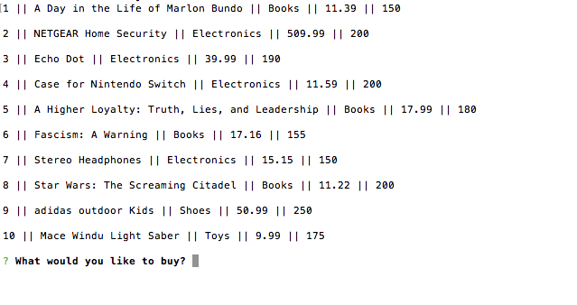

# Bamazon

Bamazon is a node app that lets the customer buy from a list of products. The list is stored in a MySQL database.

The user is prompted with a list of items with price and stock quantity.

