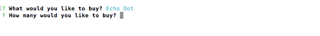
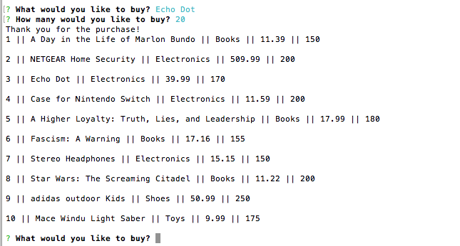
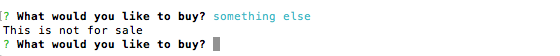
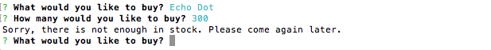

# Bamazon

Bamazon is a node app that lets the customer buy from a list of products. The list is stored in a MySQL database.

The user is prompted with a list of items, and a qustion of what he would like to buy.

When the user list an item he is prompted with another question of the quantity of items he would like to purchase.

A "Thank you" message is prompted and the list of items apears again with the updated item quantity.

If the user enters an item that is not on the list, he is prompted with a different mesage:

If the user would like to buy more items than available in stock quantity - 

